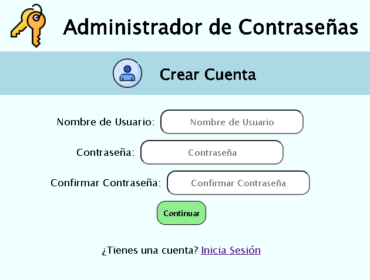
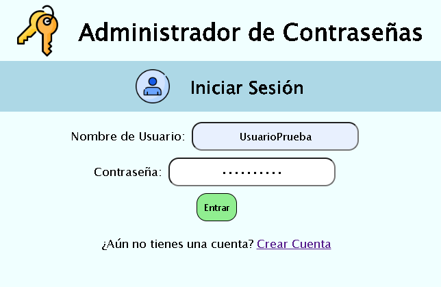
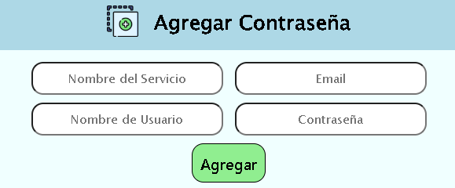
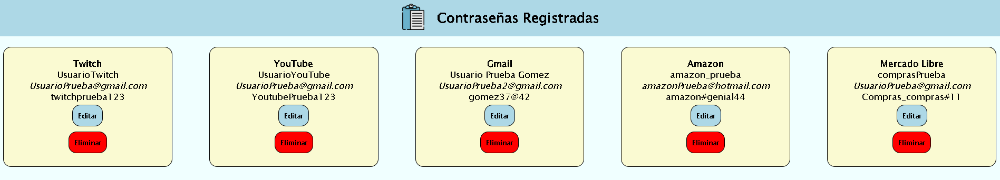
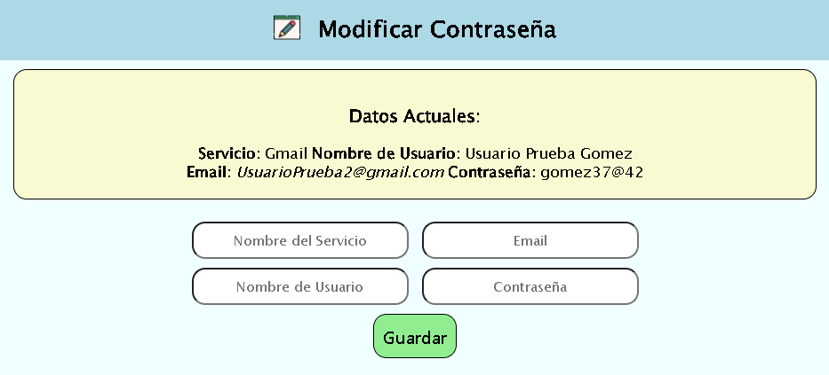

# Administrador de Contraseñas
Un administrador de contraseñas para guardar gestionar de forma sencilla.

## Tecnologías

  

    
    
Python

  

  

    
    
Django

  

  

    
    
SQLite

  

  
  

    
    
HTML5

  

  

    
    
CSS3

  

## Registrar Usuario

  

## Iniciar Sesión

  

## Agregar Contraseña

  

## Listar Contraseñas

  

## Modificar Contraseña

  

